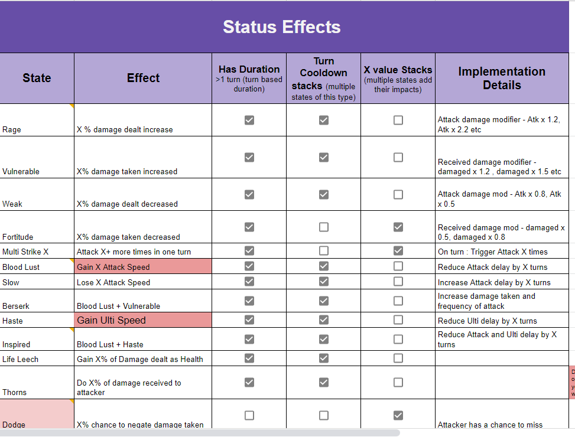

# Ultimate Battle Arena Case Study

**Client**: FRAG Games  
**Role**: Lead Game Designer  

## Overview
When I joined FRAG Games, the development of their AFK Arena-inspired blockchain game was already underway. However, the design for the cards and characters had been neglected. My role was to overhaul and reimagine the card and character systems, aligning them with both AFK Arena's mechanics and FRAG's in-house CCG engine inspired by Hearthstone.

The challenge was complex, with many moving parts, including redesigning the class system, enhancing the battle mechanics, and creating scalable synergies for the characters to foster engaging player experiences.

## Challenges & Solutions
### Turn Order and Status Effects
The Hearthsotne inspired design had to be changed because we needed a global turn counter similar to AFK Arena's design. I simplified the current turn system and created a document to be shared across departments. 
### Class System Overhaul
The existing class system, inspired by Hearthstone, treated each deck as a separate class. However, in this game, each card needed to belong to a single class—Tank, Warrior, Ranged, Mage, or Support. I redesigned the class system to be modular, allowing each player to have a loadout of 15 cards, with active parties consisting of 5 cards (one from each class). This redesign added depth and strategic decision-making for players, encouraging experimentation.

### Creating Synergies for Strategic Gameplay
From my experience with turn-based RPGs, I identified that synergies between cards would be key to a meaningful player experience. Players needed multiple options for synergies to experiment with different strategies, especially in PvP battles. To achieve this, I:
- Created a **random deck generator in Excel** to evaluate possible synergies within the existing design.
- Discovered that the current design was rigid and not future-proof, making it difficult for junior designers to create meaningful synergies.

### Introducing the Meta-Character Concept
To address these challenges, I introduced the idea of treating the active party of 5 characters as a single "meta-character" composed of 5 abilities. This concept allowed players to mix and match characters to create unique strengths and strategies, much like how characters in fighting games have distinct abilities but are balanced against each other.

This approach led to a modular design for the classes:
- **Tanks** specialized in defense.
- **Warriors** focused on physical attacks.
- **Mages** provided magic-based damage.
- **Supports** offered healing or buffs.
- **Ranged** characters added tactical distance-based attacks.

Each class had archetypes with specific strengths, introducing creative trade-offs and making it easier for junior designers to contribute effectively.

### Stat Rankings & Battle System Integration
I then created high-level stats for each archetype, assigning ranks to describe their behavior. Each archetype had 18 rank points distributed across different stats, which introduced meaningful trade-offs. For example, a Tank might have high defense but lower attack speed. This point ranking system anchored each archetype's relative strengths on a shared level playing field, ensuring balance.

| 
|:--:|
|*Points Based Class System*|

However, the ranks couldn't directly map onto the battle system. To solve this, I designed a **middle layer** that converted high-level stat ranks into low-level battle attributes. This middle layer distilled stat ranks into parameters like attack power, crit damage, and cooldown reduction, which made the battle equations more coherent and allowed for balanced gameplay.

| 
|:--:|
|*Points Based Class System*|

### Automation & Efficiency
To streamline the design process, I used **Google Apps Script** to automate the generation of card stats based on their archetype and rank. This allowed us to generate low-level values for each card's strength, which varied based on the card's rarity (e.g., Common, Rare). The automation saved time and ensured consistency across the hundreds of cards.

## Outcome
- **Improved Scalability**: The modular class and meta-character approach made the design future-proof and allowed for efficient content expansion.
- **Enhanced Collaboration**: The new structure made it easier for junior designers to understand and contribute, improving overall team productivity.
- **Balanced Gameplay**: The introduction of stat rankings and the middle layer ensured that each card archetype was balanced, leading to a fair and engaging player experience.
- **Positive Feedback**: The CEO of FRAG Games, Ali Ihsan, praised the redesign for reducing the workload for the entire team and making the game development process smoother and more collaborative.

---

[Back to Projects](./projects.md)
